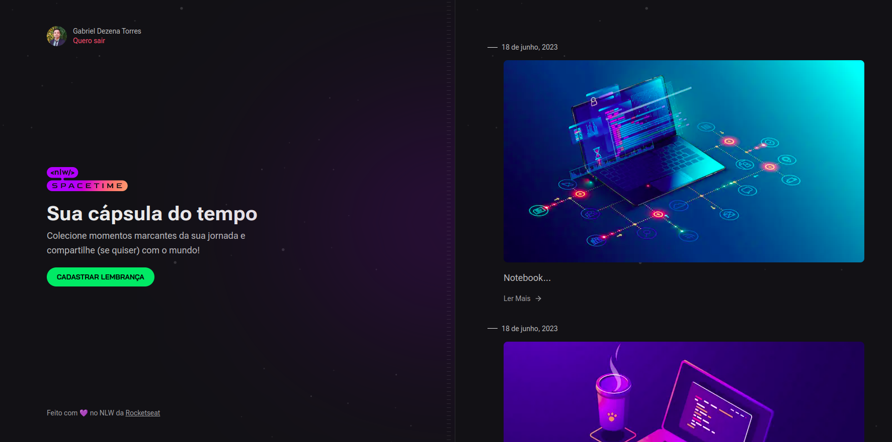

# NLW - Spacetime - Rocketseat :rocket:
## Aplicação
Cápsula do tempo, onde o usuário é capaz de registrar suas memórias com imagens, verificando a autentificação do usuário com o seu Github tanto na versão WEB como Mobile

  

## Tecnologias

### Backend
- Node.js
- Typescript + TSX
- Fastify (Framework)
- Prisma + SQLite

### Frontend
- React
- Next.js
- Typescript
- TailwindCSS

### Mobile
- Nativewind
- Expo
